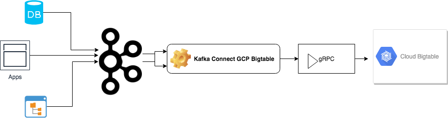

# Kafka Sink Connect GCP Bigtable

Apache Kafka Sink only Connect can be used to stream messages from Apache Kafka to Google Cloud Platform (GCP) wide column store Bigtable.

## What is Apache Kafka?

Apache Kafka is an open-source stream processing platform developed by the Apache Software Foundation written in Scala and Java. The project aims to provide a unified, high-throughput, low-latency platform for handling real-time data feeds. For more details, please refer to [Apache Kafka home page](https://kafka.apache.org/).

## What is GCP Bigtable?

Bigtable is a compressed, high performance, proprietary data storage system built on Google File System, Chubby Lock Service, SSTable and a few other Google technologies. On May 6, 2015, a public version of Bigtable was made available as a service in the Google Cloud Platform. For more details, please refer to [GCP Bigtable home page](https://cloud.google.com/bigtable/).

## High Level Architecture

This project use [bigtable-client-core](https://mvnrepository.com/artifact/com.google.cloud.bigtable/bigtable-client-core) library to stream data to GCP Bigtable. [bigtable-client-core](https://mvnrepository.com/artifact/com.google.cloud.bigtable/bigtable-client-core) internally use the [gRPC](https://grpc.io/) framework to talk to GCP Bigtable.



## Prerequisites

[Apache ZooKeeper](https://zookeeper.apache.org) and [Apache Kafka](https://kafka.apache.org) installed and running in your machine. Please refer to respective sites to download and start ZooKeeper and Kafka. You would also need Java version 8 or above.

### Tested Software Versions

| Software      | Version       |           
| ------------- |---------------| 
| Java          | 1.8.0_161     | 
| Kafka         | 2.11-2.1.0    |
| Zookeeper     | 3.4.13        |
| bigtable-client-core | 1.8.0  |
| Kafka connect-api | 2.1.0     |
| grpc-netty-shaded | 1.16.1    |

## Configurations

### bigtable-sink.properties

| Property      					  | Value       				    | Data Type    | Description     								|       
|---------------------------------|-----------------------------|--------------|------------------------------------------------	|
| name          					  | bigtable-sink    		 	| String		   |                 								|
| connector.class        		  | BigtableSinkConnector       | String	       |                 								|
| tasks.max        				  | 1 							| Number 	   | Numbers of tasks.								|
| topics							  | demo-topic					| String		   | Comma separated list of topics. 				|
| topics.config.files.location    | kafka_home/config    		| String		   |	 There should be one yml file per topic names.  	|	

### demo-topic.yml

| Property      					| Value  			| Data Type |					   Description       				   		 						 |     
|-------------------------------|--------------------|--------------|------------------------------------------------------------------|
| keyFile	   				    |	 /home/keys/demo-instance-key.json | String	 | GCP Connect Key File. This is a topic level configuration because you could subscribe from multiple topics and messages from one topic may go to a table in instance A and messages from another topic may go to a table in instance B |		
| project 					    | demo-projec	| String |					    Name of the GCP Project | 
| instance 					    | demo-instance	 | String |				    Name of GCP Bigtable instance | 
| table 							| demo-table| 	 String |				     Name of GCP Bigtable table | 
| transformer 					| kafka.connect.gcp.transform.JsonEventTransformer | String|	   | Transformer to transform the message to Bigtable writable row. You may provide your own implementation. | 
| keyQualifiers | 		 - exchange	<br/> - symbol| Array| Bigtable row key qualifier. Configured element names would be used to construct the row keys. | 
| keyDelimiter | - | String | Delimiter to use if there are more than one element to construct row key. |
| families  	| - data	 <br/> - metadata | Array | Column families in the Bigtable table. This configuration will be used by the transformer. | 
| familyQualifiers | - data:	 <br>&bsp;- exchange <br>&bsp; - symbol <br>&bsp; - name <br>&bsp;- sector	| Column family to columns mapping. | 
						 	 
												   


## How to deploy the connector?

This is maven project. To create an [uber](https://maven.apache.org/plugins/maven-shade-plugin/index.html) jar, execute the following maven goals.

```mvn clean compile package shade:shade install```

Copy the artifact ```kafka-connect-gcp-bigtable-1.0.0.jar``` to kakfa_home/lib folder.

Copy the [bigtable-sink.properties](https://github.com/sanjuthomas/kafka-connect-gcp-bigtable/blob/master/config/bigtable-sink.properties) file into kafka_home/config folder. Update the content of the property file according to your environment.

Alternatively, you may keep the ```kafka-connect-gcp-bigtable-1.0.jar``` in another directory and export that directory into Kafka class path before starting the connector.

## How to start connector in stand-alone mode?

Open a shell prompt, move to kafka_home and execute the following.

```
bin/connect-standalone.sh config/bigtable-connect-standalone.properties config/bigtable-sink.properties
```

## How to start connector in distribute mode?

Open a shell prompt, change your working directory to kafka_home and execute the following.

```
bin/connect-distributed.sh config/bigtable-connect-distributed.properties config/bigtable-sink.properties
```

